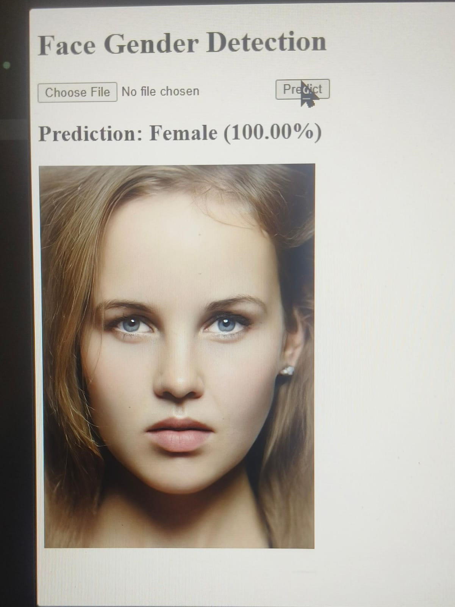
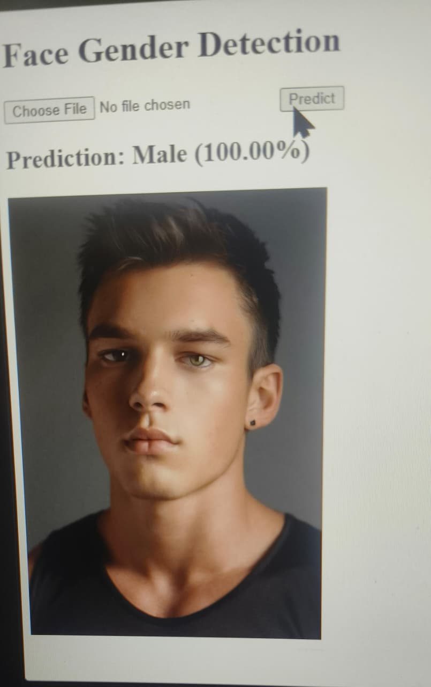

# Gender Detection Project

## Install

pip install -r requirements.txt

## Train Model

python train_model.py

## Run Web App

python app.py

## Data set

https://drive.google.com/file/d/14ICvPHRZ2F1dAxEHrXplJ-vDgV7k9ehw/view?usp=drive_link
## Output Screenshots

### Female Prediction

### Male Prediction

